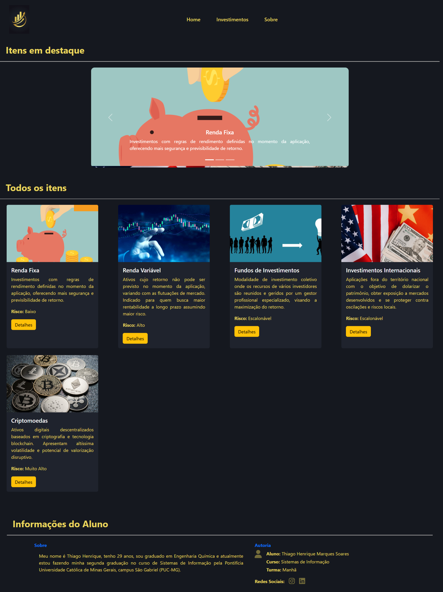
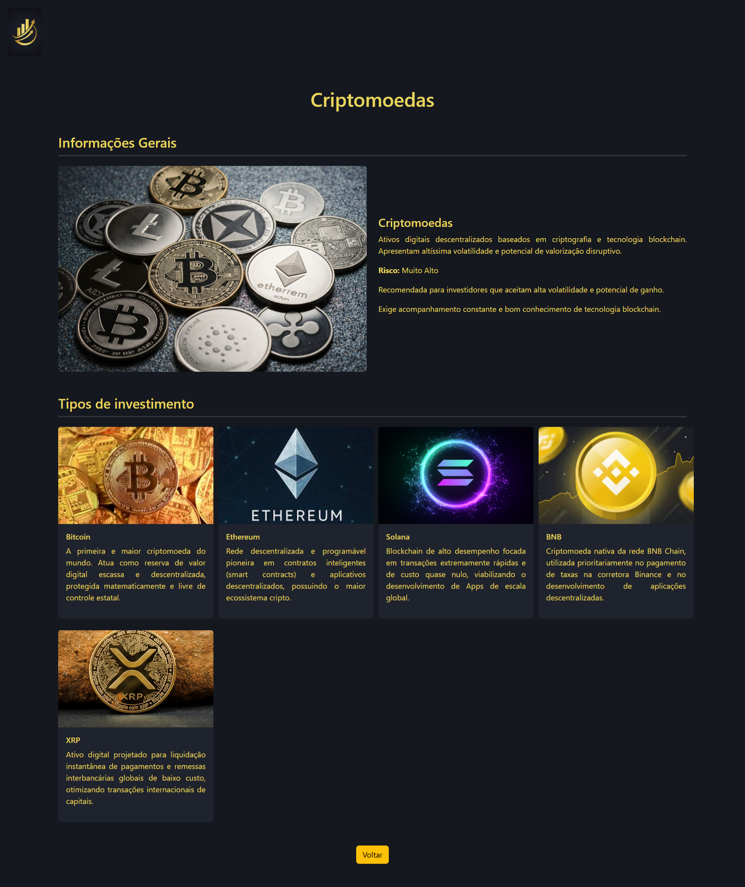

# Trabalho Prático - Semana 11

Nesta atividade, vamos evoluir o projeto em que estamos trabalhando nesse semestre, acrescentando a página de detalhes.

Imagine que a página principal (home-page) mostre um visão dos vários itens que existem no seu site. Ao clicar em um item, você é direcionado pra a página de detalhes. A página de detalhe vai mostrar todas as informações sobre o item do seu projeto, seja esse item uma notícia, filme, receita, lugar turístico ou evento.

## Informações Gerais

- Nome: Thiago Henrique Marques Soares
- Matricula: 926400
- Decreva brevemente seu projeto: Este projeto tem o objetivo de apresentar algumas classes de investimentos (entidade principal), bem como detalhes de cada um deles com diversos tipos de investimentos de cada classe (entidade secundária).

## Prints do trabalho





## Dados em JSON
Inclua aqui a estrutura de dados definida por você para o projeto com pelo menos dois exemplo de dados.

```json
const dados = {
  "investimento": [
    {
      "id": 1,
      "nome": "Renda Fixa",
      "risco": "Baixo",
      "descricao": "Investimentos com regras de rendimento definidas no momento da aplicação, oferecendo mais segurança e previsibilidade de retorno.",
      "imagem_principal": "images/renda_fixa.jpeg",
      "informacao-1": "Ideal para quem busca preservar capital, garantir retornos mais previsíveis e até formar uma reserva de emergência",
      "informacao-2": "Pode ter 3 tipos de rentabilidades: Pré-fixado, Pós-fixada e híbrido",
      "tipos": [
        {
          "id": 1,
          "nome": "CDB (Certificado de Depósito Bancário)",
          "descricao": "Título de dívida emitido por bancos para captar recursos, garantido pelo Fundo Garantidor de Créditos (FGC) até R$ 250 mil por CPF e instituição.",
          "imagem": "images/cdb.jpg"
        },
        {
          "id": 2,
          "nome": "Tesouro Selic",
          "descricao": "Título público emitido pelo Governo Federal que rende de acordo com a taxa Selic. É considerado o investimento mais seguro e líquido do país.",
          "imagem": "images/tesouro_selic.png"
        },
        {
          "id": 3,
          "nome": "Tesouro IPCA+",
          "descricao": "Título do Tesouro Direto que rende uma taxa fixa pré-contratada mais a variação da inflação oficial (IPCA), garantindo ganho real acima da inflação.",
          "imagem": "images/tesouro_ipca+.png"
        },
        {
          "id": 4,
          "nome": "LCI/LCA",
          "descricao": "Letras de Crédito Imobiliário e do Agronegócio emitidas por bancos, isentas de Imposto de Renda para pessoas físicas e garantidas pelo FGC.",
          "imagem": "images/lci_lca.png"
        },
        {
          "id": 5,
          "nome": "Debentures",
          "descricao": "Títulos de dívida emitidos por empresas privadas (sociedades anônimas) para financiar grandes projetos. Não contam com a proteção e garantia do FGC.",
          "imagem": "images/debentures.png"
        }
      ]
    },
    {
      "id": 2,
      "nome": "Renda Variável",
      "risco": "Alto",
      "descricao": "Ativos cujo retorno não pode ser previsto no momento da aplicação, variando com as flutuações de mercado. Indicado para quem busca maior rentabilidade a longo prazo assumindo maior risco.",
      "imagem_principal": "images/renda_variavel.png",
      "informacao-1": "Indicada para investidores dispostos a enfrentar oscilações em busca de alta rentabilidade.",
      "informacao-2": "A melhor escolha para metas de longo prazo com perfil de risco agressivo.",
      "tipos": [
        {
          "id": 1,
          "nome": "Ações",
          "descricao": "Frações mínimas do capital social de uma empresa. Ao comprar ações, o investidor torna-se sócio da companhia e participa de seus lucros e valorização.",
          "imagem": "images/acoes.png"
        },
        {
          "id": 2,
          "nome": "Fundos Imobiliários",
          "descricao": "Condomínios fechados focados na exploração de imóveis físicos de grande porte (shoppings, galpões) ou títulos imobiliários, distribuindo rendimentos mensais isentos de IR.",
          "imagem": "images/fundos_imobiliarios.png"
        },
        {
          "id": 3,
          "nome": "ETF'S",
          "descricao": "Exchange Traded Funds. Fundos negociados em Bolsa que replicam o desempenho de um índice financeiro, como o Ibovespa, permitindo diversificação rápida.",
          "imagem": "images/etf.jpg"
        },
        {
          "id": 4,
          "nome": "Commodities",
          "descricao": "Investimentos em matérias-primas globais de larga escala, como ouro, petróleo, soja e café. Excelentes alternativas para diversificação geográfica e proteção.",
          "imagem": "images/commodities.png"
        },
        {
          "id": 5,
          "nome": "BDR (Brazilian Depositary Receipts)",
          "descricao": "Certificados emitidos no Brasil que representam ações de empresas globais cotadas no exterior, permitindo investir em gigantes multinacionais sem sair da bolsa brasileira.",
          "imagem": "images/bdr.png"
        }
      ]
    },
    {
      "id": 3,
      "nome": "Fundos de Investimentos",
      "risco": "Escalonável",
      "descricao": "Modalidade de investimento coletivo onde os recursos de vários investidores são reunidos e geridos por um gestor profissional especializado, visando a maximização do retorno.",
      "imagem_principal": "images/fundos-investimento.jpg",
      "informacao-1": "Permite diversificar investimentos com gestão profissional.",
      "informacao-2": "Bom para quem prefere delegar a seleção de ativos a especialistas.",
      "tipos": [
        {
          "id": 1,
          "nome": "Fundos de Renda Fixa",
          "descricao": "Fundos que alocam a maior parte da carteira em ativos de renda fixa, como títulos públicos e privados, buscando acompanhar taxas de juros de forma diversificada.",
          "imagem": "images/fundo_renda_fixa.png"
        },
        {
          "id": 2,
          "nome": "Fundo de Ações",
          "descricao": "Fundos focados no mercado acionário, alocando no mínimo 67% de seu patrimônio em ações. Ideal para buscar retornos robustos no longo prazo com gestão ativa.",
          "imagem": "images/fundos_acoes.png"
        },
        {
          "id": 3,
          "nome": "Fundos Multimercado",
          "descricao": "Fundos com estratégias de investimento dinâmicas e flexíveis, que transitam por juros, câmbio, ações e commodities de acordo com as oportunidades de mercado.",
          "imagem": "images/fundos_multimercados.jpg"
        },
        {
          "id": 4,
          "nome": "Fundos Cambiais",
          "descricao": "Fundos que buscam acompanhar a oscilação de moedas fortes estrangeiras, como o Dólar ou o Euro. Recomendado para fins de proteção patrimonial contra desvalorização local.",
          "imagem": "images/fundos_cambiais.jpg"
        },
        {
          "id": 5,
          "nome": "FIDCs (Fundos de Investimento em Direitos Creditórios)",
          "descricao": "Fundos que adquirem contas a receber de empresas (direitos creditórios, como duplicatas ou recebíveis de cartão). Oferecem altos rendimentos e risco de crédito.",
          "imagem": "images/fidcs.png"
        }
      ]
    },
    {
      "id": 4,
      "nome": "Investimentos Internacionais",
      "risco": "Escalonável",
      "descricao": "Aplicações fora do território nacional com o objetivo de dolarizar o patrimônio, obter exposição a mercados desenvolvidos e se proteger contra oscilações e riscos locais.",
      "imagem_principal": "images/investimentos_internacionais.png",
      "informacao-1": "Ajuda a proteger o patrimônio contra riscos cambiais e econômicos locais.",
      "informacao-2": "Oferece exposição a mercados globais e a grandes empresas estrangeiras.",
      "tipos": [
        {
          "id": 1,
          "nome": "Stocks",
          "descricao": "Investimento direto em ações de empresas de alto valor listadas nas bolsas americanas (NYSE e NASDAQ), permitindo ter participação direta em gigantes inovadoras do planeta.",
          "imagem": "images/stocks.png"
        },
        {
          "id": 2,
          "nome": "REITs",
          "descricao": "Real Estate Investment Trusts. Empresas do setor imobiliário americano que operam propriedades de grande porte e pagam dividendos recorrentes e em dólares.",
          "imagem": "images/reits.jpg"
        },
        {
          "id": 3,
          "nome": "ETF's Globais",
          "descricao": "Fundos de índice internacionais negociados em bolsas estrangeiras, fornecendo diversificação massiva e instantânea por países, setores ou commodities globais.",
          "imagem": "images/etfs_globais.png"
        },
        {
          "id": 4,
          "nome": "Bonds Americanas",
          "descricao": "Títulos de dívida pública do Tesouro dos EUA ou de corporações globais emitidas em dólares. Considerados a renda fixa com maior segurança geopolítica do mundo.",
          "imagem": "images/bonds.jpg"
        },
        {
          "id": 5,
          "nome": "Moeda Estrangeira",
          "descricao": "Aquisição física ou saldo em contas internacionais de moedas fortes como Dólar ou Euro, ideal para preservação imediata de valor e despesas internacionais futuras.",
          "imagem": "images/moedas_estrangeiras.png"
        }
      ]
    },
    {
      "id": 5,
      "nome": "Criptomoedas",
      "risco": "Muito Alto",
      "descricao": "Ativos digitais descentralizados baseados em criptografia e tecnologia blockchain. Apresentam altíssima volatilidade e potencial de valorização disruptivo.",
      "imagem_principal": "images/criptomoedas.jpg",
      "informacao-1": "Recomendada para investidores que aceitam alta volatilidade e potencial de ganho.",
      "informacao-2": "Exige acompanhamento constante e bom conhecimento de tecnologia blockchain.",
      "tipos": [
        {
          "id": 1,
          "nome": "Bitcoin",
          "descricao": "A primeira e maior criptomoeda do mundo. Atua como reserva de valor digital escassa e descentralizada, protegida matematicamente e livre de controle estatal.",
          "imagem": "images/bitcoin.jpg   "
        },
        {
          "id": 2,
          "nome": "Ethereum",
          "descricao": "Rede descentralizada e programável pioneira em contratos inteligentes (smart contracts) e aplicativos descentralizados, possuindo o maior ecossistema cripto.",
          "imagem": "images/ethereum.jpg"
        },
        {
          "id": 3,
          "nome": "Solana",
          "descricao": "Blockchain de alto desempenho focada em transações extremamente rápidas e de custo quase nulo, viabilizando o desenvolvimento de Apps de escala global.",
          "imagem": "images/solana.png"
        },
        {
          "id": 4,
          "nome": "BNB",
          "descricao": "Criptomoeda nativa da rede BNB Chain, utilizada prioritariamente no pagamento de taxas na corretora Binance e no desenvolvimento de aplicações descentralizadas.",
          "imagem": "images/bnb.jpg"
        },
        {
          "id": 5,
          "nome": "XRP",
          "descricao": "Ativo digital projetado para liquidação instantânea de pagamentos e remessas interbancárias globais de baixo custo, otimizando transações internacionais de capitais.",
          "imagem": "images/xrp.jpg"
        }
      ]
    }
  ]
}
```


